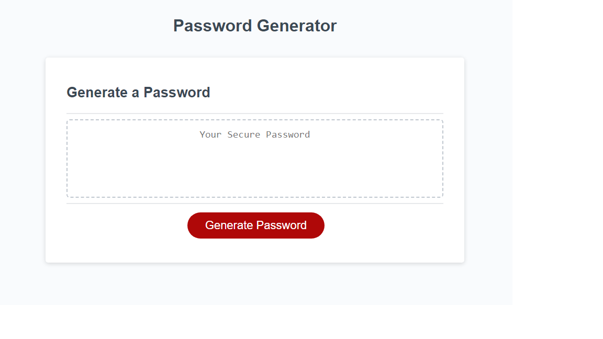

# <Random Password Generator>

## Description

This website will allow the user to generate a random password after they click on the "Generate Password" button. It prompts the user to answer a few questions to generate a password based of of their requirements.

## Installation

The password generator can be accessed at https://alices9.github.io/password-generator/

## Usage

Click on the "Generate Password" button and answer the prompts to generate a random password. The password can be selected and copied to the user's desired location.

## Features

The random generated password can be copied.

## Tests

The password generator will not continue if the user attempts to generate a password that is fewer than 8 characters or more than 128 characters.
